# Azure Data Factory Medallion Architecture ETL Pipeline

Although, this looks and seems very beginner level basic ETL project, however this project was capable enough to familiarize me so well with lot of core concepts and Datafactory as tool.

- I learnt the navigational aspects of not only Azure cloud account, but also services like Datafactory and Azure Storage.

- With this project, I made sure that I understand core behavior and functionalities of ETL on cloud, core concepts like:
- Resource groups
- Integration runtime
- Datasets
- Linked Service
- Blob containers
- Data Flow

- Progressing one step further, I also tried advnaced concepts like Medallion archirecture, transformations & aggregations in Datafactory, output file partitions.

## Pipeline Architecture

Step 1 — Source Data
A CSV file containing sample retail sales data is stored in the Raw container of Azure Blob Storage.

Step 2 — Azure Data Factory Pipeline
A pipeline is created in ADF with a Copy Activity to move data from the raw container to the processed container.

Step 3 — Linked Services
Two linked services were configured:
- Source Blob Storage
- Destination Blob Storage

Step 4 — Dataset Configuration
Datasets were created for:
- Source CSV file
- Destination CSV file

Step 5 — Data Movement
ADF Copy Activity performs the following:
- Reads CSV file
- Preserves schema
- Copies file to processed storage container

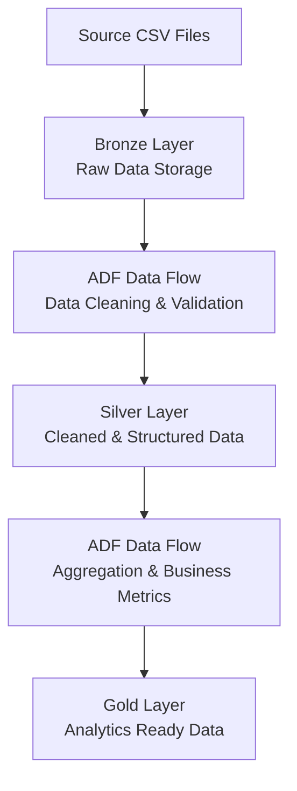

## Source Data Understanding:
- A very small & simple Sales data

| Layer  | Purpose                         |
| ------ | ------------------------------- |
| Bronze | Raw data                        |
| Silver | Clean structured data           |
| Gold   | Business-ready analytics tables |

Problems intentionally included

| Problem                | Example       |
| ---------------------- | ------------- |
| Duplicate order        | order_id 1006 |
| Missing customer       | order_id 1005 |
| Invalid price          | `abc`         |
| Negative quantity      | -1            |
| Missing city           | order 1008    |
| Missing payment method | order 1009    |
| Missing order_date     | order 1012    |

Cleaning examples:
- remove duplicates
- fix null values
- remove invalid rows
- correct datatypes

**To move Bronze → Silver with cleaning transformations in Azure Data Factory, I used Mapping Data Flow.**

## Now, I will represent the ETL & steps of Transformations in visual screenshots:

**Bronze Layer Storage**
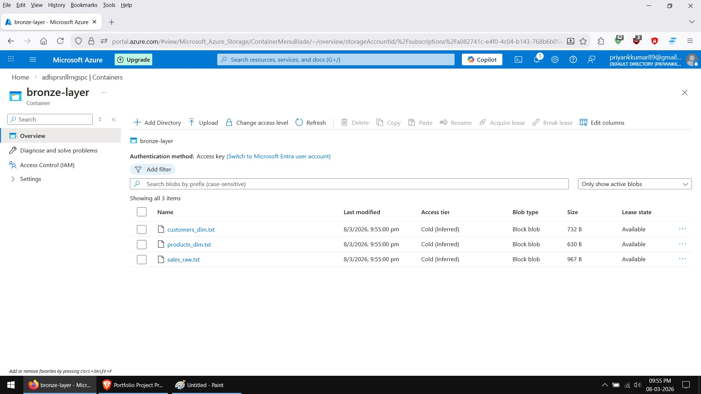

**Created Dataset for Blob storage**
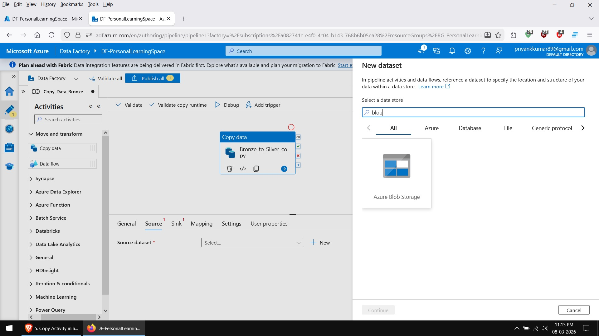

**Created Linked Service**
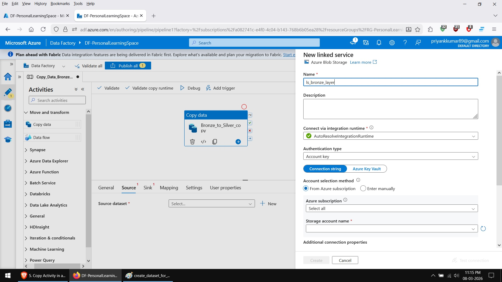

**Silver Layer after Transformation**
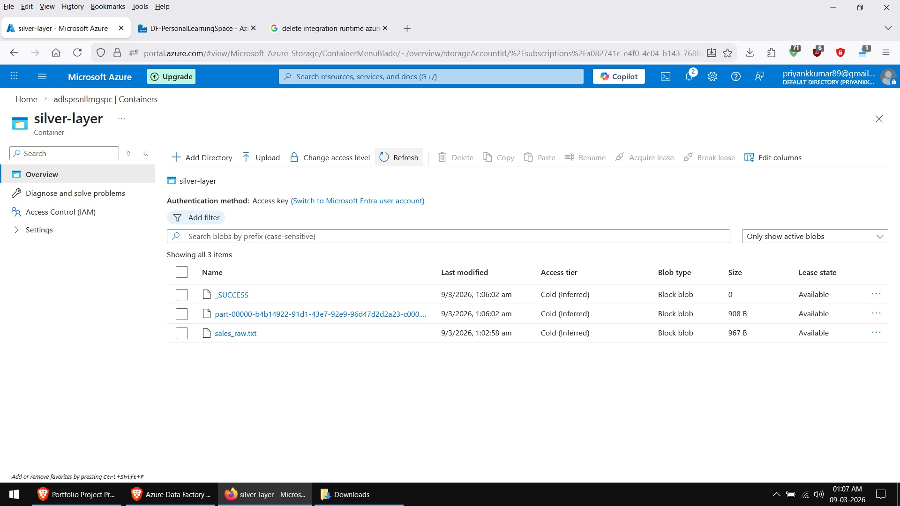

**Transformation Example**
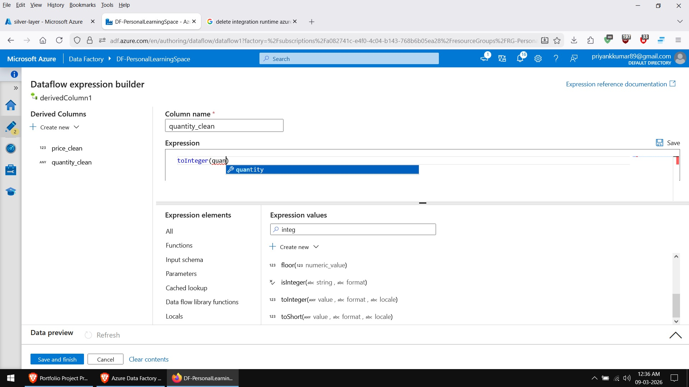

**Transformation Example**
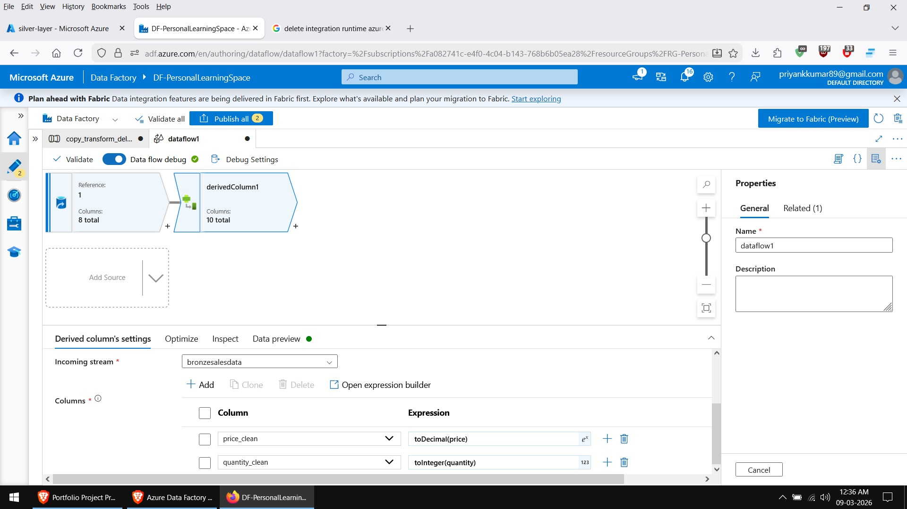

**Transformation Example**
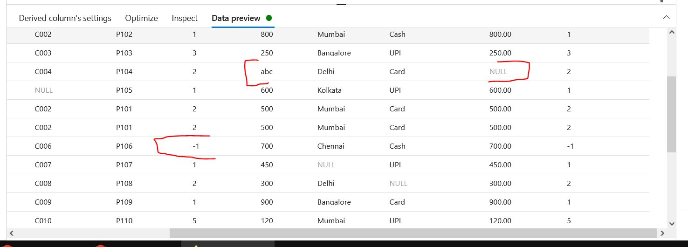

**Transformation Example**
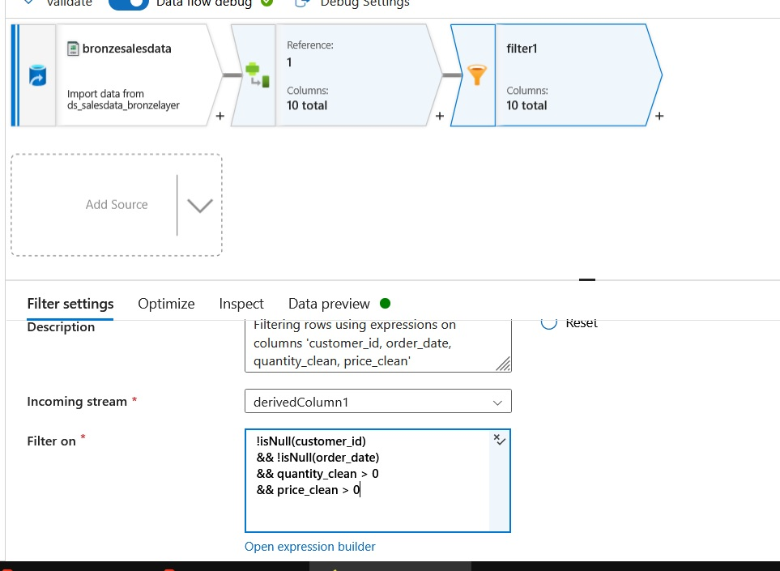

**Transformation Example**
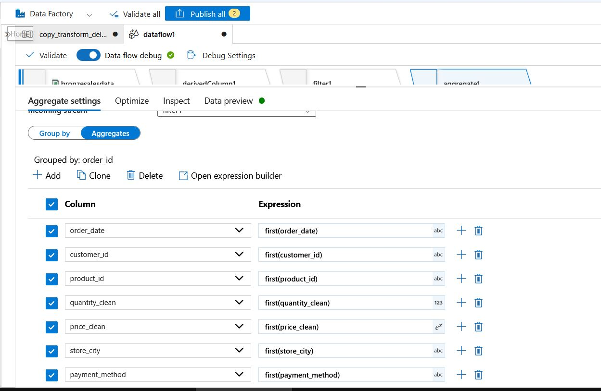

**Transformation Example**
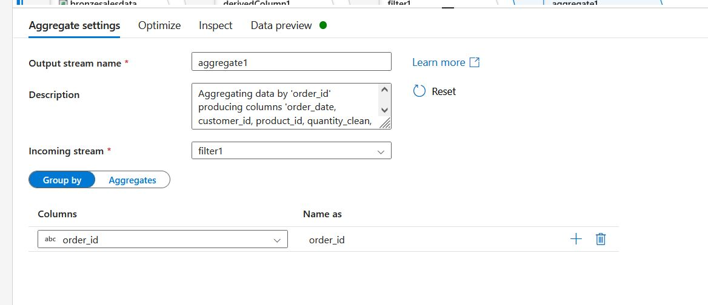

**Transformation Example**
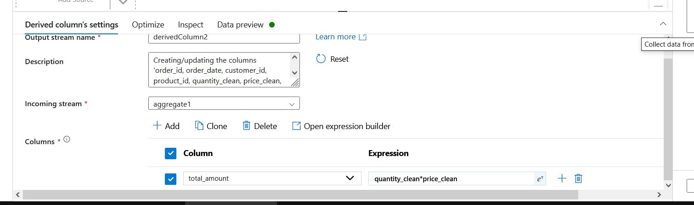

**Pipeline Runtime**
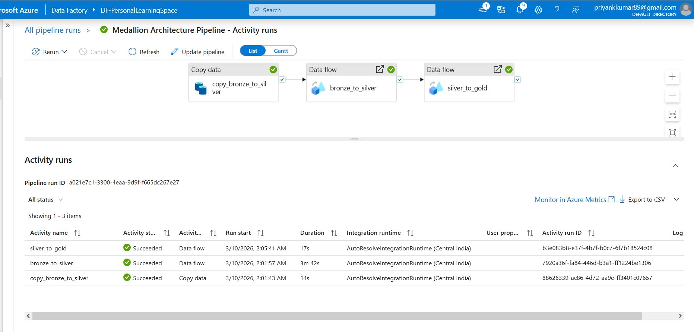

**Final Aggregated Gold layer data**
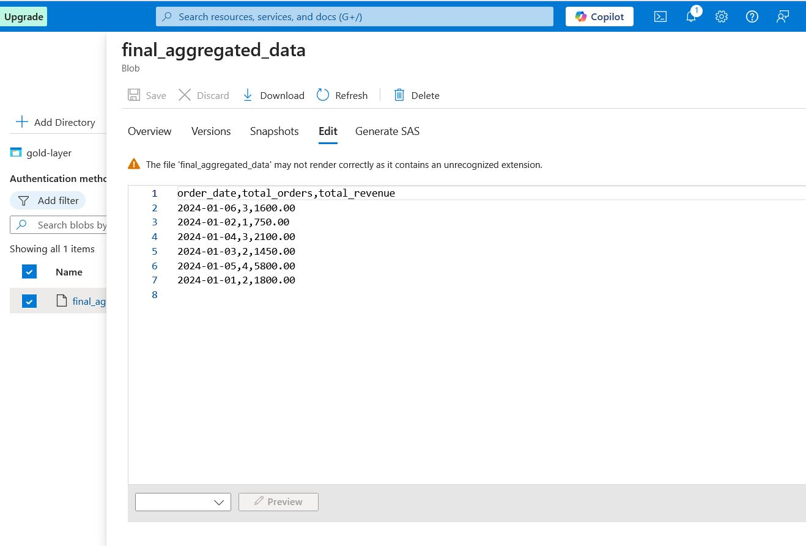
