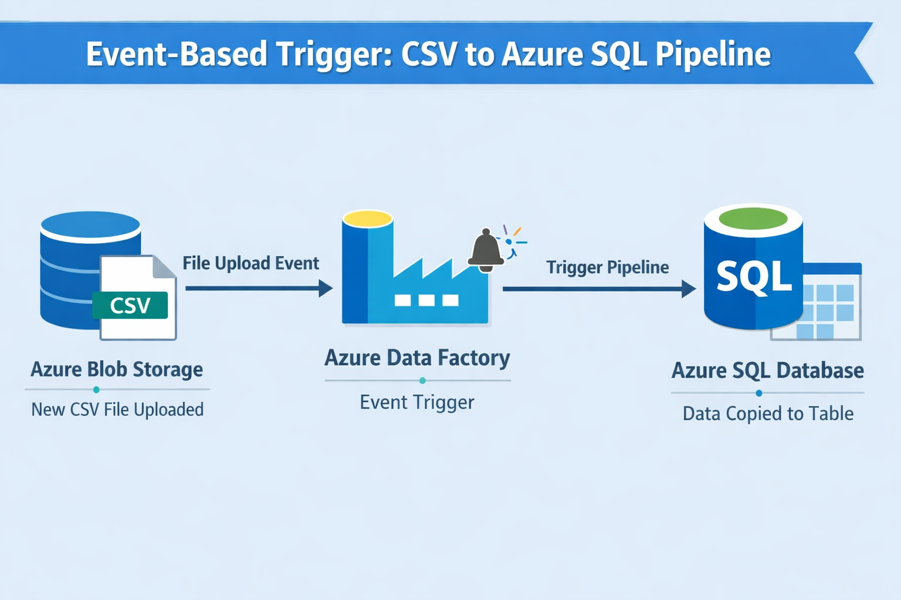
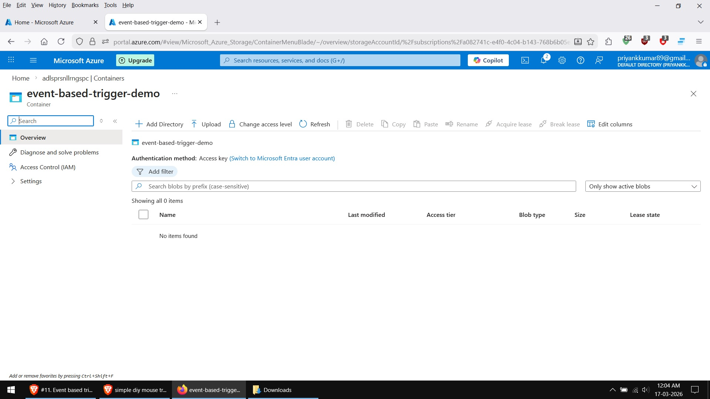
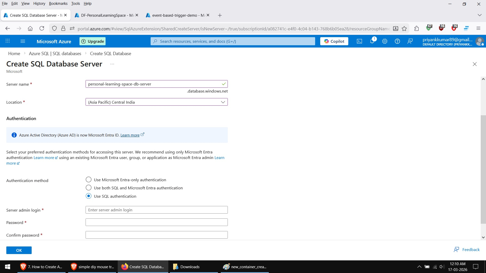
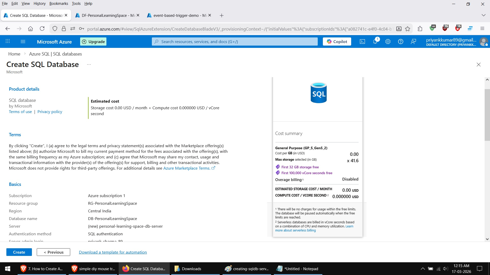
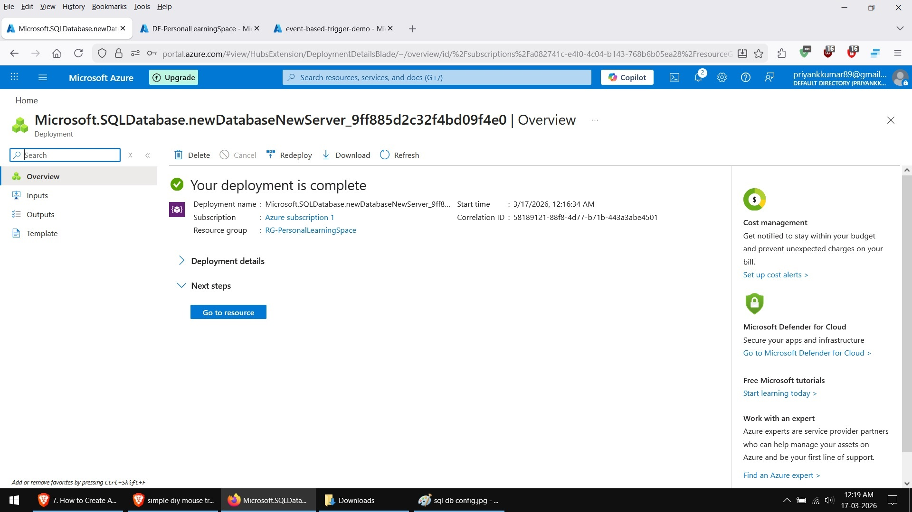

# Event Based Pipeline Trigger

## Pipeline Steps & Configurations:

**New blob Container created for this demo**

**Creating Azure SQL DB Server**

**SQL DB Config**

**SQL Server Deployment complete**

**New blob Container created for this demo**

**New blob Container created for this demo**

**New blob Container created for this demo**

**New blob Container created for this demo**

**New blob Container created for this demo**

**New blob Container created for this demo**

**New blob Container created for this demo**

